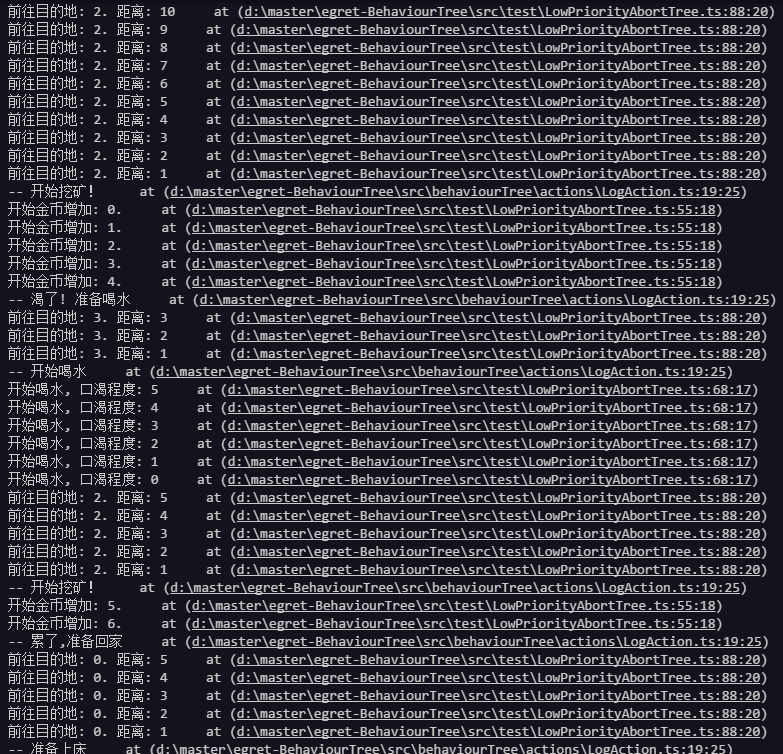

# BehaviourTree、UtilityAI、FSM
基于ecs-framework开发的AI（BehaviourTree、UtilityAI、FSM）系统，一套已经非常完整的系统。大家可以自行看源代码来学习，项目当中也有好几个示例，如果对项目你有更多的解决方案可发起 `pull request`请求或者有任何疑问可发起`issue`。

## 目录结构

- src `源目录`
  - behaviourTree   `行为树主目录`
    - actions `动作是行为树的节点。比如： 播放动画，触发事件等。`
    - composites `Composites是行为树中的父节点，他们容纳一个或多个子节点，并以不同的方式执行。`
    - conditionals `它们由IConditional接口标识。它们会检查游戏世界的某些情况，并返回成功或失败`
    - decorators `装饰器可以通过各种方式修改子任务的行为，例如： 反转结果，运行知道失败等`
  - utilityAI `实用AI主目录`
    - actions `AI执行的操作`
    - considerations `列出评估和行为清单。计算一个分数，用数字表示Action的有效使用情况。`
    - reasoners `从附加的Reasoner的事项列表中选择最佳的事项。AI的根源`
  - core    `egret核心扩展`
  - test    `示例工程`
    - utilityActions `实用AI示例目录`

### 关于 `行为树`

> 行为树由节点树组成。节点可以根据世界状态做出决策并执行操作。它包含一个BehaviorTreeBuilder类，它提供了一个用于设置行为树的API。BehaviorTreeBuilder是一种使行为树减少使用并快速启动的方法。

#### Composites

- Sequence 一旦子节点返回失败，就返回失败。如果子节点返回成功，它将在行为树的下一帧运行下一个子节点。
- Selector 只要子节点任意一个返回成功，就返回成功。如果子节点返回失败，它将在行为树的下一帧运行下一个子节点。
- Parallel 运行每个子节点直到子节点返回失败。它不同于Sequence仅在于它在每帧都会运行所有子节点
- ParallelSelector 同Selector,除了它自身将在每帧都运行所有子节点
- ParallelSequence 同Sequence,除了它自身将在每帧都运行所有子节点
- RandomSequence 同Sequence，在执行前将子节点随机打乱后运行
- RandomSelector 同Selector, 在执行前将子节点随机打乱后运行

#### Conditional

- RandomProbability: 当随机概率高于指定的成功率时返回成功
- ExecuteActionConditional: 包装一个Func并未做Conditional执行。用于原型设计和避免为简单的条件创建单独的类。

#### Decoration

- AlwaysFail: 无论子结果如何，总是返回失败
- AlwaysSuccedd: 无论子结果如何，总是返回成功
- ConditionalDecorator: 包装条件，并且仅在满足条件时才运行其子项。
- Repeater: 重复其子任务指定次数
- UntilFail: 继续执行其子任务，直到返回失败
- UntilSuccess: 继续执行其子任务，直到返回成功
- Inverter: 反转子结果

#### Action

- ExecuteAction: 包装一个Func并将其作为动作执行。
- WaitAction： 等待指定的时间
- LogAction：将字符串记录到控制台用于调试。
- BehaviorTreeReference:运行另一个行为树

### 关于 `实用AI`

> 最复杂的AI解决方案。最适合在动态环境中使用，基于效用的AI可以采取大量潜在竞争行为的情况。

## 游戏实例



## 使用文档

```typescript
class AiComponent{
    private _tree: BehaviorTree<AiComponent>;
    public state: State = new State();
    private _distanceToNextLocation: number = 10;
    public update(){
        if (this._tree)
            this._tree.tick();
    }

    public start(){
        let builder = BehaviorTreeBuilder.begin(this);

        builder.selector(AbortTypes.Self);

        // 睡觉最重要
        builder.conditionalDecoratorR(m => m.state.fatigue >= State.MAX_FATIGUE, false);
        builder.sequence(AbortTypes.LowerPriority)
            .logAction("-- 累了,准备回家")
            .action(m => m.goToLocation(Locate.Home))
            .logAction("-- 准备上床")
            .action(m => m.sleep())
            .endComposite();

        // 喝水第二重要
        builder.conditionalDecoratorR(m => m.state.thirst >= State.MAX_THIRST, false);
        builder.sequence(AbortTypes.LowerPriority)
            .logAction("-- 渴了! 准备喝水")
            .action(m => m.goToLocation(Locate.Saloon))
            .logAction("-- 开始喝水")
            .action(m => m.drink())
            .endComposite();

        // 存钱第三重要
        builder.conditionalDecoratorR(m => m.state.gold >= State.MAX_GOLD, false);
        builder.sequence(AbortTypes.LowerPriority)
            .logAction( "--- 背包满了，准备去银行存钱." )
            .action( m => m.goToLocation( Locate.Bank ) )
            .logAction( "--- 开始存钱!" )
            .action( m => m.depositGold() )
            .endComposite();

        // 赚钱最后
        builder.sequence()
            .action(m => m.goToLocation(Locate.Mine))
            .logAction("-- 开始挖矿！")
            .action(m => m.digForGold())
            .endComposite();

        builder.endComposite();

        this._tree = builder.build();
    }

    private digForGold(): TaskStatus{
        console.log(`开始金币增加: ${this.state.gold}.`);
        this.state.gold++;
        this.state.fatigue++;
        this.state.thirst++;

        if( this.state.gold >= State.MAX_GOLD )
            return TaskStatus.Failure;

        return TaskStatus.Running;
    }

    private drink(): TaskStatus{
        console.log(`开始喝水, 口渴程度: ${this.state.thirst}`);

        if( this.state.thirst == 0 )
            return TaskStatus.Success;

        this.state.thirst--;
        return TaskStatus.Running;
    }

    private sleep(): TaskStatus{
        console.log(`开始睡觉, 当前疲惫值: ${this.state.fatigue}`);

        if (this.state.fatigue == 0)
            return TaskStatus.Success;
        
        this.state.fatigue--;
        return TaskStatus.Running;
    }

    private goToLocation(location: Locate): TaskStatus{
        console.log(`前往目的地: ${location}. 距离: ${this._distanceToNextLocation}`);

        if (location != this.state.currentLocation){
            this._distanceToNextLocation--; 
            if (this._distanceToNextLocation == 0){
                this.state.fatigue ++;
                this.state.currentLocation = location;
                this._distanceToNextLocation = Math.floor(Random.range(2, 8));
                return TaskStatus.Success;
            }

            return TaskStatus.Running;
        }

        return TaskStatus.Success;
    }

    private depositGold(): TaskStatus{
        this.state.goldInBank += this.state.gold;
        this.state.gold = 0;

        console.log(`存钱进入银行. 当前存款 ${this.state.goldInBank}`);

        return TaskStatus.Success;
    }
}
```

```typescript
class State{
    public static MAX_FATIGUE: number = 10;
    public static MAX_GOLD = 8;
    public static MAX_THIRST = 5;

    public fatigue: number = 0;
    public thirst: number = 0;
    public gold: number = 0;
    public goldInBank: number = 0;
    public currentLocation: Locate = Locate.Home;
}

enum Locate{
    Home,
    InTransit,
    Mine,
    Saloon,
    Bank
}
```

这两个文件是主要行为树文件。最后只需要在主文件当中进行实例化 `AiComponent`. 

```typescript
this.aiComponent = new AiComponent();
this.aiComponent.start();
```

并且对egret当中`egret.Event.ENTER_FRAME`进行监听。让行为树系统进行每帧更新

```typescript
this.aiComponent.update();
```


## 依赖库

[ecs-framework](https://github.com/esengine/ecs-framework)